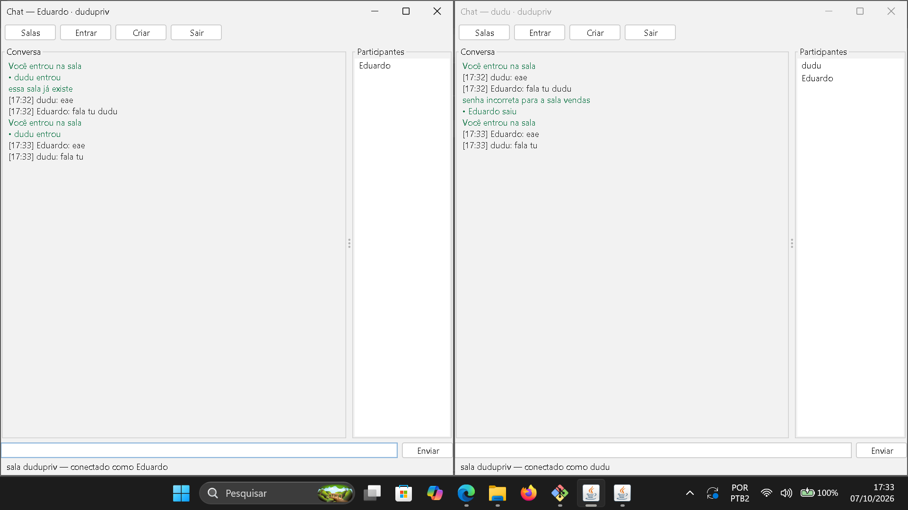

# ChatViaSocket

[](https://github.com/EduardoAlvez/ChatViaSocket1.0/actions/workflows/ci.yml)
[](LICENSE)


## 📌 Visão Geral

Bate-papo em tempo real usando **sockets TCP**, com **protocolo próprio**,
**salas com senha**, histórico persistido em disco e interface gráfica —
feito em Java puro, sem bibliotecas de rede.



## ✨ Funcionalidades

- **Salas**: a sala `geral` existe sempre; crie quantas quiser com `/criar`
  e troque de sala com `/entrar` sem se desconectar
- **Senha por sala** (SHA-256 + salt) — só quem tem a senha entra, e ela
  nunca aparece no tráfego; sala criada sem senha é aberta para todos
- **Persistência**: salas (`historico/salas.tsv`) e histórico de cada sala
  (`historico/<sala>.txt`) sobrevivem ao reinício do servidor — com rotação
  automática para não crescer sem fim
- **Cliente gráfico** com FlatLaf (Swing) e cliente de console — mesma rede,
  mesma sala, juntos
- **Múltiplos clientes** conectados ao mesmo tempo (limite de 100 por sala)
- **Broadcast** de mensagens públicas com **hora carimbada pelo servidor**
- **Entrada/saída anunciadas** para a sala inteira (`fulano entrou` / `saiu`)
- **Mensagens privadas** (`/w`) — só o destinatário e quem enviou enxergam
- **Histórico**: quem entra recebe as **últimas 20 mensagens** na hora
- **Lista de participantes** a qualquer momento (`/lista`)
- **Servidor também fala**: o operador digita no console e todos recebem
- **Broadcast não bloqueante**: fila de envio por cliente — um cliente lento
  é desconectado em vez de travar o chat de todo mundo
- **Graceful shutdown**: `/sair` no servidor avisa todos os clientes antes de fechar
- **Validação nos dois lados**: nome (16 chars, sem espaço), mensagem (500 chars)
  e senha de sala (4 a 32 chars)
- **IP e porta configuráveis** por linha de comando (dá para jogar em outra máquina)

## 🚀 Como Executar

### ✅ Pré-requisitos

- **JDK 17** ou superior
- **Maven 3.9+** (ou só o JDK, se baixar o jar da [Release](https://github.com/EduardoAlvez/ChatViaSocket1.0/releases))

### 1️⃣ Compilar

```bash
mvn package
```

O jar final (`target/chat-via-socket-1.1.0.jar`) já embute o FlatLaf
— não precisa de dependências extras para rodar.

### 2️⃣ Subir o servidor

```bash
java -jar target/chat-via-socket-1.1.0.jar          # porta 6666
java -jar target/chat-via-socket-1.1.0.jar 7777      # porta outra
```

Salas e histórico são gravados na pasta `historico/` ao lado de onde o
servidor foi executado. No console do servidor: `/salas` lista as salas,
`/sair` encerra avisando todo mundo, e qualquer texto vira aviso geral.

### 3️⃣ Abrir os clientes

**Cliente gráfico (Swing):**

```bash
java -cp target/chat-via-socket-1.1.0.jar com.portfolio.chat.cliente.swing.ClienteSwing
java -cp target/chat-via-socket-1.1.0.jar com.portfolio.chat.cliente.swing.ClienteSwing 192.168.0.10 6666
```

Aparece um diálogo de login (nome e servidor) e depois a janela do chat,
com botões **Salas**, **Entrar**, **Criar** e **Sair**.

**Cliente de console (terminal):**

```bash
java -cp target/chat-via-socket-1.1.0.jar com.portfolio.chat.cliente.ClienteChat
java -cp target/chat-via-socket-1.1.0.jar com.portfolio.chat.cliente.ClienteChat 192.168.0.10 6666
```

Pela IDE: rode as classes `ServidorChat`, `ClienteSwing` ou `ClienteChat`
(mains separados). No primeiro prompt, **digite seu nome** e pronto para conversar.

## 🕹️ Comandos do Cliente

| Comando | O que faz |
|---------|-----------|
| `/lista` | mostra quem está na sala |
| `/salas` | lista as salas existentes (com `*` no fim = têm senha) |
| `/criar <sala> [senha]` | cria a sala e já entra nela |
| `/entrar <sala> [senha]` | troca para outra sala (pede senha se tiver) |
| `/w <nick> <mensagem>` | mensagem privada só para aquela pessoa |
| `/ajuda` | resumo dos comandos |
| `/sair` | sai da sala e desconecta |
| texto livre | vira mensagem pública para todos |

No **cliente gráfico**, Salas/Entrar/Criar abrem pequenos diálogos com os
mesmos campos — mesma rede e mesmas salas do cliente de console.

## 📦 Protocolo

Os quadros são strings UTF com campos separados por `|` — simples de ler no
tcpdump e de testar sem dependência nenhuma:

| Quadro | Origem | Significado |
|--------|--------|-------------|
| `ENTRAR\|nome` | cliente → servidor | pedido de entrada |
| `OK\|nome` | servidor → cliente | entrada aceita |
| `ERRO\|motivo` | servidor → cliente | recusa ou uso inválido |
| `ENTROU\|nome` / `SAIU\|nome` | servidor → sala | notificação da sala |
| `MSG\|hora\|de\|texto` | cliente → servidor → sala | mensagem pública |
| `PRIVADO\|hora\|de\|para\|texto` | cliente → servidor → alvo | mensagem privada |
| `LISTA` / `LISTA\|nicks` | cliente ↔ servidor | quem está na sala |
| `HIST\|hora\|de\|texto` | servidor → cliente | mensagens anteriores ao entrar |
| `CRIARSALA\|sala\|salt\|hash` | cliente → servidor | cria sala com senha (hash, nunca a senha) |
| `ENTRASALA\|sala` | cliente → servidor | troca de sala (a senha vai no desafio abaixo) |
| `CHAVE\|salt\|nonce` | servidor → cliente | desafio: entra com a prova da senha |
| `ENTRASALAH\|sala\|resposta` | cliente → servidor | prova = SHA-256(hash + nonce) |
| `SALAS` / `SALAS\|sala1,sala2` | cliente ↔ servidor | lista de salas (`*` = com senha) |
| `SALOK\|sala` | servidor → cliente | sala atual confirmada |
| `SAIR` | cliente → servidor | sair da sala |
| `FIM\|motivo` | servidor → sala | servidor encerrou |

O texto é sempre o **último** campo, então pode conter `|` sem quebrar o parse.
A senha **nunca trafega no fio**: na criação vai só `salt + hash` e na entrada
o servidor manda um nonce (`CHAVE`) e o cliente responde com a prova —
o servidor guarda apenas o hash SHA-256 com salt.

## ⚙️ Como Funciona Por Dentro

- **Fila por cliente**: o broadcast só faz `offer()` na fila de cada um — quem
  não lê enche a fila e é **desconectado**, nunca trava os outros
- **Ordem consistente**: registro, broadcast e histórico correm sob a mesma
  trava, então todo mundo vê a sequência na mesma ordem
- **Duas threads por cliente** no servidor: uma lê, outra escreve (drena a fila)
- **Cliente**: uma thread só para receber, a principal só digita — a janela
  nunca trava esperando rede
- **GUI na EDT**: os quadros recebidos são repassados à Swing com
  `SwingUtilities.invokeLater`; o interpretador (`InterpretadorTela`) é puro
  e testável sem abrir janela

## 🏗️ Estrutura do Projeto

```plain
ChatViaSocket1.0/
├── pom.xml                               # Build Maven (Java 17, JUnit 5, shade)
├── .github/workflows/ci.yml              # CI: build + testes + jar
├── chat.png                              # Print do chat rodando
├── historico/                            # Salas e histórico (criado em execução)
└── src/
    ├── main/java/com/portfolio/chat/
    │   ├── Log.java                      # Log com hora no console
    │   ├── protocolo/                    # Protocolo, Quadro, TipoQuadro...
    │   ├── servidor/                     # ServidorChat, salas, senha, histórico
    │   ├── cliente/                      # ClienteChat, Recebedor, Renderizador
    │   └── cliente/swing/                # ClienteSwing, TelaChat, InterpretadorTela
    └── test/java/com/portfolio/chat/     # 116 testes JUnit 5
```

## 🧪 Testes

```bash
mvn test
```

**116 testes** em 10 suítes:

- **Protocolo** — parse, validação de nome/mensagem/senha, montagem dos quadros
- **Senha da sala** — hash SHA-256 + salt, comparação e validação
- **Gerenciador de salas** — criar/trocar, senha errada, unicidade, broadcast por sala
- **Persistência** — gravação TSV e histórico por arquivo
- **Clientes** — registro, nomes duplicados, broadcast, cliente lento
- **Renderização** — cada quadro vira a linha certa no console
- **Tela (Swing)** — o interpretador vira eventos certos sem abrir janela
- **Integração** — servidor de verdade em porta efêmera conversando por
  socket real: entrada, whisper, salas com senha, histórico, sala cheia,
  encerramento, reinício com disco e timeout de quem entra e não fala nada

Roda em qualquer máquina, sem Docker e sem rede externa.

## 🛠️ Tecnologias

- **Java 17** — `ServerSocket`/`Socket` e `DataInputStream`/`DataOutputStream`
- **Threads + ExecutorService** — um atendimento por cliente, escrita em fila
- **FlatLaf 3.5** — visual moderno no cliente Swing
- **JUnit 5** + Maven Surefire
- **Maven Shade** — jar único com dependências embutidas
- **GitHub Actions** — build e testes a cada push

## 📄 Licença

Distribuído sob a licença [MIT](LICENSE).
